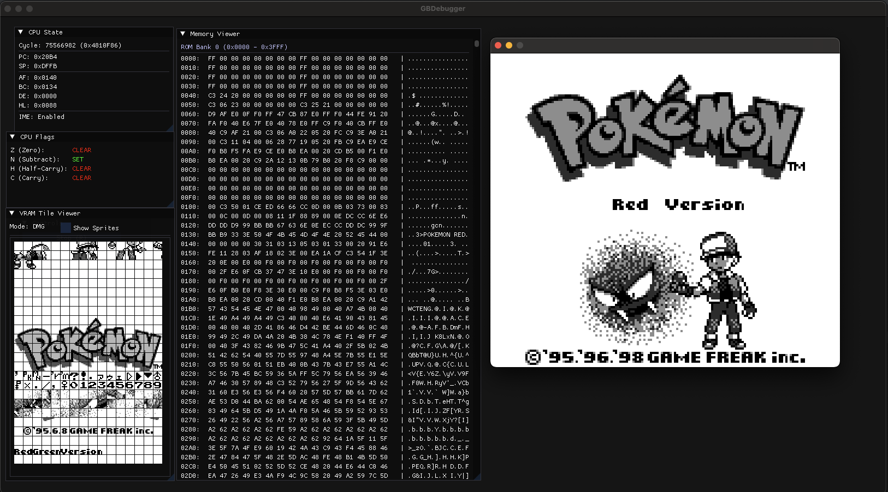

# GBDebugger

An emulator-agnostic GameBoy debugger library using Dear ImGui.



## Overview

GBDebugger provides a graphical debugging interface for GameBoy emulators. It displays CPU state, registers, flags, and memory contents in real-time. The library is designed to work with any GameBoy emulator through a simple, standard C++ API.

## Features

- **CPU State Display**: View cycle count, PC, SP, and all register pairs (AF, BC, DE, HL)
- **Flag Visualization**: Clear display of Z, N, H, C flags
- **Memory Viewer**: Hex dump of the full 64KB address space with ASCII representation
- **Memory Map Segmentation**: Visual separation of GameBoy memory regions
- **Emulator-Agnostic**: Works with any emulator through standard C++ types

## Building

GBDebugger uses CMake and automatically fetches ImGui as a dependency.

```bash
mkdir build
cd build
cmake ..
make
```

## Usage

```cpp
#include "GBDebugger.h"

// Create debugger instance
GBDebug::GBDebugger debugger;

// Open the debugger window
if (debugger.Open()) {
    // Update CPU state each cycle
    debugger.UpdateCPU(cycle, pc, sp, af, bc, de, hl, ime);
    
    // Update memory periodically
    debugger.UpdateMemory(memory_buffer, 65536);
    
    // Render each frame
    debugger.Render();
}

// Close when done
debugger.Close();
```

## API Reference

### Lifecycle Methods

- `bool Open()` - Initialize and open the debugger window
- `void Close()` - Close the debugger and cleanup resources
- `bool IsOpen()` - Check if the debugger is currently open

### State Update Methods

- `void UpdateCPU(...)` - Update CPU state with current register values
- `bool UpdateMemory(const uint8_t* buffer, size_t size)` - Update memory contents

### Rendering

- `void Render()` - Render the debugger UI (call each frame)

## Requirements

- C++11 or later
- CMake 3.9 or later
- ImGui (automatically fetched)

## License

See LICENSE file for details.
